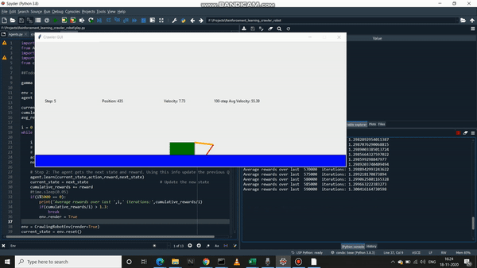

# Crawler-robot
A reinforcement learning agent learns the best way to crawl through an environment. The environment is taken from Barkeley's Deep RL Bootcamp. The algorithm used to achieve this task is SarsaMax. To overcome the exploration and exploitation dilemma, an epsilon-greedy policy is used to select the agent's action. 

